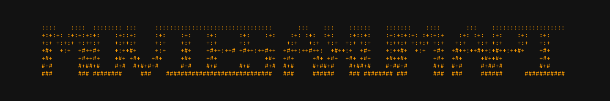

    

    
    
    
    
    

    A RESTful API built with Rust and Axum for querying CSV data over a local HTTPS connection.

---

## License

This project is licensed under the [MIT License](./LICENSE).

## Author

* [Yenterick](https://github.com/Yenterick)